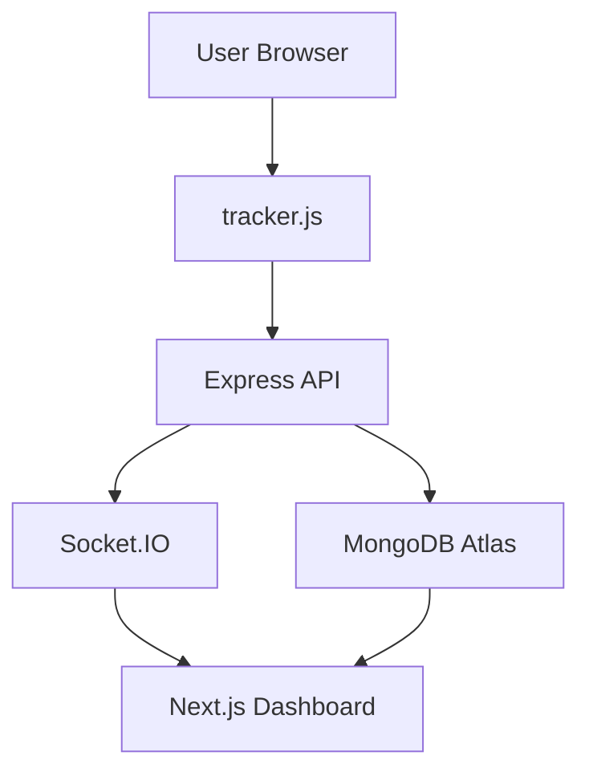
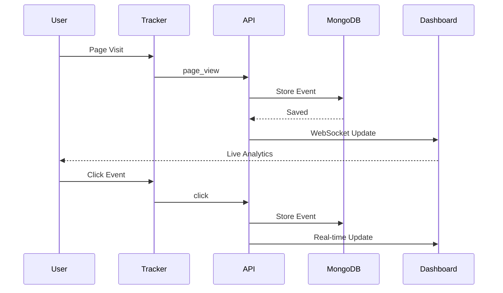

# <h1 align="center">TrackFlow AI – Real-Time User Analytics Platform</h1>

<p align="center">
  A production-ready real-time user analytics platform that captures user sessions, page views, click events, device information, and visitor behavior using a lightweight tracking script, real-time dashboards, and scalable event processing.
</p>

<p align="center">
  <a href="https://causalfunnel-user-analytics-web.vercel.app/dashboard"><strong>Live Demo</strong></a>
  |
  <a href="https://causalfunnel-user-analytics.onrender.com"><strong>Backend API</strong></a>
  |
  <a href="https://causalfunnel-user-analytics.onrender.com/health"><strong>Health</strong></a>
  |
  <a href="https://github.com/gagandeepsingh76/causalfunnel-user-analytics"><strong>Repository</strong></a>
</p>

<p align="center">
  
  
  
  
  
  
</p>

<p align="center">
  
</p>

---

# TrackFlow AI

TrackFlow AI is a full-stack real-time analytics platform designed to capture, process, and visualize user behavior across websites and applications.

The platform provides:

* Real-time session tracking
* Page view analytics
* Click event monitoring
* Device analytics
* Country tracking
* Session journey analysis
* Live dashboard updates
* CSV export functionality
* Lightweight tracking script integration

TrackFlow AI enables product teams, startups, and businesses to understand how users interact with their applications through a simple yet scalable analytics infrastructure.

---

# Live Demo

<p align="center">
  <a href="https://causalfunnel-user-analytics-web.vercel.app/dashboard">
    <strong>https://causalfunnel-user-analytics-web.vercel.app/dashboard</strong>
  </a>
</p>

---

# Backend API

<p align="center">
  <a href="https://causalfunnel-user-analytics.onrender.com">
    <strong>https://causalfunnel-user-analytics.onrender.com</strong>
  </a>
</p>

---

# Health Endpoint

<p align="center">
  <a href="https://causalfunnel-user-analytics.onrender.com/health">
    <strong>https://causalfunnel-user-analytics.onrender.com/health</strong>
  </a>
</p>

```bash
curl https://causalfunnel-user-analytics.onrender.com/health
```

---

# GitHub Repository

<p align="center">
  <a href="https://github.com/gagandeepsingh76/causalfunnel-user-analytics">
    <strong>https://github.com/gagandeepsingh76/causalfunnel-user-analytics</strong>
  </a>
</p>

---

# Product Screenshots

## Analytics Dashboard

<p align="center">

</p>

---

## Real-Time Session Monitoring

<p align="center">

</p>

---

## Session Analytics

<p align="center">
 

</p>

---

## CSV Export

<p align="center">
 

</p>

---

# Why TrackFlow AI?

Most analytics solutions are either:

* Expensive
* Difficult to integrate
* Over-engineered
* Privacy-invasive

TrackFlow AI provides a lightweight analytics system that can be embedded into any website using a single tracking script.

The platform focuses on:

* Fast integration
* Real-time visibility
* Session-based analytics
* Event-driven architecture
* Developer-friendly APIs

---

# Problem Statement

Modern websites require visibility into user behavior.

Organizations need answers to questions such as:

* Which pages are users visiting?
* How many sessions are active?
* What actions are users taking?
* Which devices are most commonly used?
* Which countries generate the most traffic?
* What is the user journey across pages?

TrackFlow AI solves these challenges through a lightweight tracking architecture and real-time analytics dashboard.

---

# System Architecture



---

# Event Collection Flow



---

# Key Features

* Real-Time Analytics Dashboard
* Session Tracking
* Page View Monitoring
* Click Event Tracking
* Device Analytics
* Country Analytics
* Session Journey Analysis
* CSV Export
* WebSocket Updates
* MongoDB Event Storage
* Tracker Script Integration
* Live Metrics Updates
* REST API Architecture
* Production Deployment Ready

---

# Technology Stack

| Layer            | Technology            |
| ---------------- | --------------------- |
| Frontend         | Next.js 15            |
| Language         | TypeScript            |
| Styling          | Tailwind CSS          |
| Backend          | Express.js            |
| Database         | MongoDB Atlas         |
| Realtime         | Socket.IO             |
| API              | REST                  |
| Hosting          | Vercel + Render       |
| Build Tool       | npm                   |
| Analytics Engine | Custom Event Pipeline |

---

# Project Structure

```text
causalfunnel-user-analytics/

├── apps/
│
├── api/
│   ├── src/
│   ├── routes/
│   ├── services/
│   ├── models/
│   └── tracker.js
│
├── web/
│   ├── app/
│   ├── components/
│   ├── hooks/
│   ├── store/
│   └── lib/
│
├── README.md
│
└── DEPLOYMENT.md
```

---

# API Endpoints

| Method | Endpoint       | Description           |
| ------ | -------------- | --------------------- |
| GET    | /health        | Health Check          |
| GET    | /api/sessions  | Fetch Sessions        |
| GET    | /api/events    | Fetch Events          |
| POST   | /api/events    | Store Analytics Event |
| GET    | /tracker.js    | Tracking Script       |
| GET    | /api/analytics | Dashboard Analytics   |

---

# Environment Variables

## Backend

```env
PORT=10000

MONGODB_URI=your_mongodb_connection_string

API_CORS_ORIGIN=https://causalfunnel-user-analytics-web.vercel.app
```

## Frontend

```env
NEXT_PUBLIC_API_URL=https://causalfunnel-user-analytics.onrender.com

NEXT_PUBLIC_SOCKET_URL=https://causalfunnel-user-analytics.onrender.com
```

---

# Deployment Status

| Service        | Platform      | Status    |
| -------------- | ------------- | --------- |
| Frontend       | Vercel        | Live      |
| Backend        | Render        | Live      |
| Database       | MongoDB Atlas | Connected |
| WebSocket      | Socket.IO     | Active    |
| Event Tracking | Production    | Working   |

---

# Verification

Verified successfully:

* Dashboard loads correctly
* Events endpoint returns 201
* Session analytics working
* MongoDB connected
* WebSocket connected
* CSV export functional
* Tracker.js loaded globally
* Production deployment successful

---

# Author

**Gagandeep Singh**

GitHub: https://github.com/gagandeepsingh76

Project:
https://github.com/gagandeepsingh76/causalfunnel-user-analytics

---

# License

MIT License
